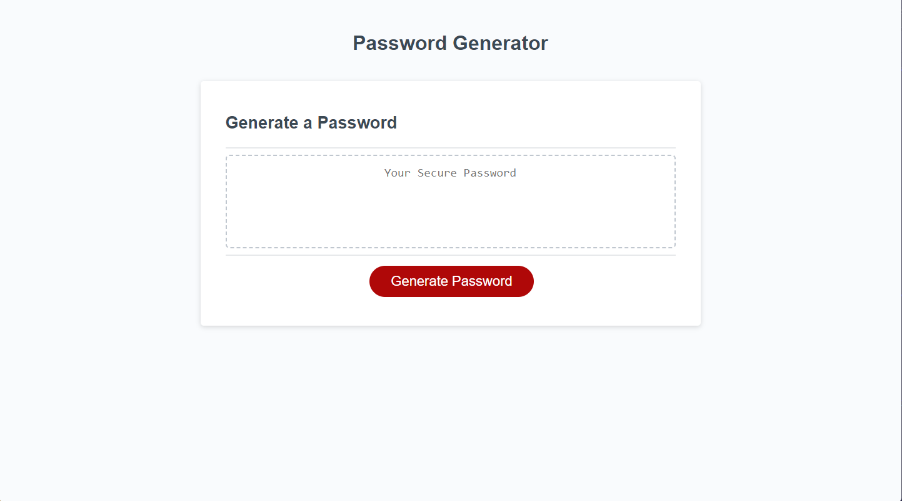

Description

This project is to create a Password Generator using JavaScript.  The generator needs to prompt the user with password criteria and then randomly create a passsword with 8 to 128 characters.   The user will click the button to generate a password and then be presented with the 5 following prompts:  length of the passsword, if they want to include lowercase characters, uppercase characters, numeric characters, and/or special characters.  The code will validate that they choose a password length that is at least 4 characters and no more than 128 characters and choose at least one type of character for the generator to use. A password will be generated and displayed on the page.

Installation

No installation required. The webpage can be used on any web browswer with nothing extra.

How to Use

To generate a password with this website, follow the link below, press the "Generate Password" button and follow the prompts.

Link
https://ms-meredith-mcd.github.io/PasswordGenerator/

Screenshot

Credits

Thank you to the EdX Full Stack Bootcamp with the University of Minnesota for the lessons, comments, and starter code.  Thank you as well to Tyler Peterson for the one last thing I needed and Pete Maynard for his guidance and support!

License

MIT License

Copyright (c) 2023 MeredithMcD

Permission is hereby granted, free of charge, to any person obtaining a copy
of this software and associated documentation files (the "Software"), to deal
in the Software without restriction, including without limitation the rights
to use, copy, modify, merge, publish, distribute, sublicense, and/or sell
copies of the Software, and to permit persons to whom the Software is
furnished to do so, subject to the following conditions:

The above copyright notice and this permission notice shall be included in all
copies or substantial portions of the Software.

THE SOFTWARE IS PROVIDED "AS IS", WITHOUT WARRANTY OF ANY KIND, EXPRESS OR
IMPLIED, INCLUDING BUT NOT LIMITED TO THE WARRANTIES OF MERCHANTABILITY,
FITNESS FOR A PARTICULAR PURPOSE AND NONINFRINGEMENT. IN NO EVENT SHALL THE
AUTHORS OR COPYRIGHT HOLDERS BE LIABLE FOR ANY CLAIM, DAMAGES OR OTHER
LIABILITY, WHETHER IN AN ACTION OF CONTRACT, TORT OR OTHERWISE, ARISING FROM,
OUT OF OR IN CONNECTION WITH THE SOFTWARE OR THE USE OR OTHER DEALINGS IN THE
SOFTWARE.